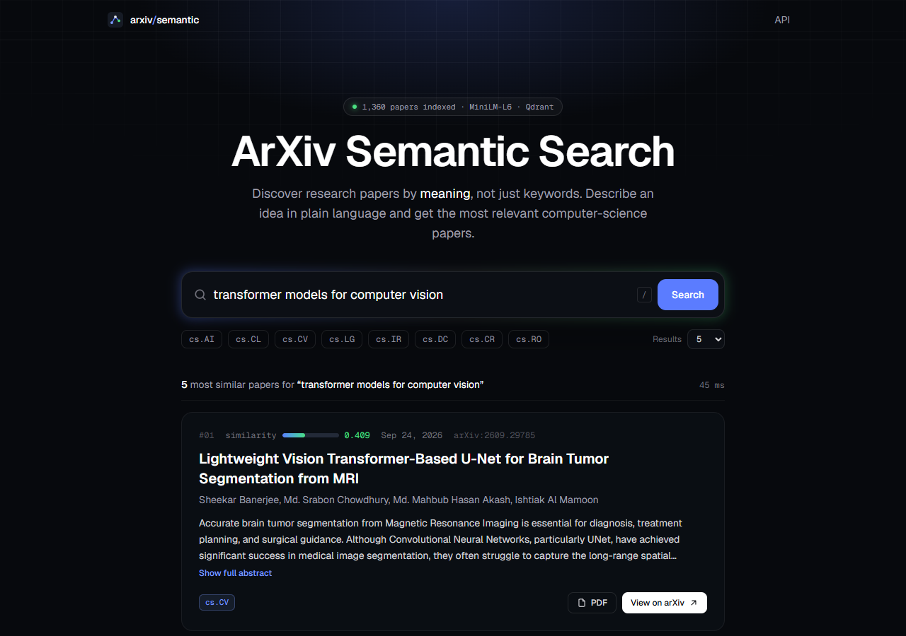
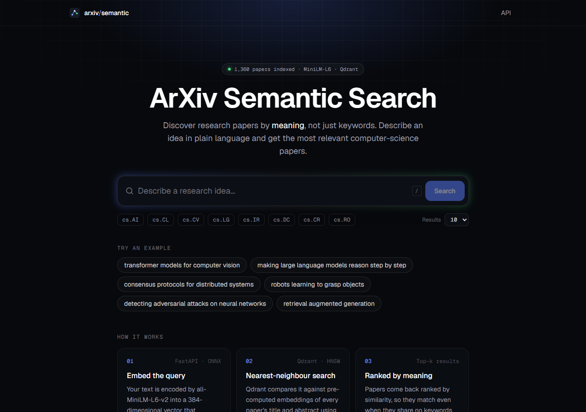
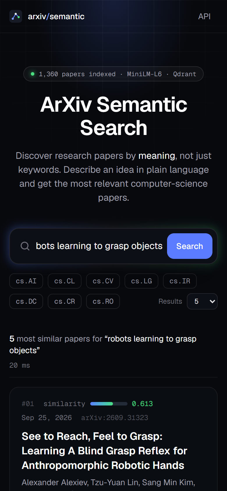
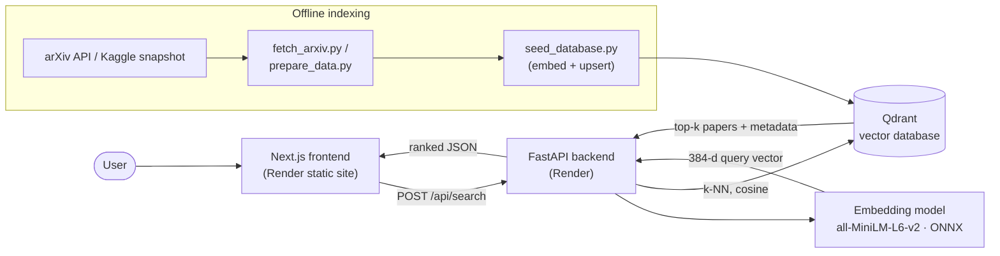

# ArXiv Semantic Search

**Discover research papers by meaning, not just keywords.**

A full-stack semantic search engine for arXiv computer-science papers. Describe an idea in plain
English, like *"robots learning to grasp objects"* or *"making LLMs reason step by step"*. The app
finds the papers whose content is closest in meaning, even when they share none of your words.

**Live demo:** Local Setup Available below · **API docs:** Local Setup Available below

<p align="center">
  
</p>

<details>
<summary>More screenshots</summary>

| Home | Mobile |
|---|---|
|  |  |

</details>

---

## Features

- **Real semantic search:** sentence embeddings (`all-MiniLM-L6-v2`, 384-d) plus cosine nearest-neighbour search in Qdrant
- **Rich results:** title, authors, publication date, similarity score, category badges, expandable abstract, arXiv and PDF links
- **Filters:** restrict to arXiv categories (cs.AI, cs.CL, cs.CV, cs.LG, …) and choose 5–50 results
- **Shareable searches:** the query lives in the URL (`/?q=...&cat=cs.CV`), so refresh and back/forward work
- **Polished UX:** loading skeletons, empty and error states, cold-start notice, `/` to focus search, fully responsive
- **Production API:** FastAPI with request validation, typed responses, CORS, health checks and OpenAPI docs
- **Runs on free tiers:** ONNX Runtime inference (no PyTorch) keeps the API at about 200 MB RAM, so it fits in 512 MB
- **Reproducible data pipeline:** scripts to fetch or filter arXiv metadata, embed it, index it and verify it
- **One-command local stack:** `docker compose up` starts Qdrant, the API and the frontend, and seeds a sample dataset

## Architecture



### How semantic search works

1. **Indexing (offline).** For every paper, `"<title>. <abstract>"` is encoded by
   [all-MiniLM-L6-v2](https://huggingface.co/sentence-transformers/all-MiniLM-L6-v2) into a 384-dimensional,
   L2-normalised vector. Papers with similar meaning land close together in that space. The vectors and the paper
   metadata are stored in a Qdrant collection that uses cosine distance.
2. **Querying (online).** The API embeds the user's query with the *same* model, then asks Qdrant for the `k`
   nearest vectors. Qdrant uses an HNSW graph index, so it doesn't compare against every paper. An optional
   payload filter restricts results to chosen categories.
3. **Ranking.** Results are ordered by cosine similarity, from −1 to 1. For this model, above about 0.5 means a strong match.

The model runs on **ONNX Runtime** with a small hand-written pipeline in `backend/app/services/embedding.py`:
tokenise, truncate to 256 tokens, mean-pool over the attention mask, then L2-normalise. It produces the same vectors as the
`sentence-transformers` library (cosine ≥ 0.99999 in testing) without its roughly 1 GB PyTorch dependency.

## Tech stack

| Layer | Technology |
|---|---|
| Frontend | Next.js 16 (App Router, static export), React 19, TypeScript, Tailwind CSS 4 |
| Backend | Python 3.12, FastAPI, Pydantic v2, Uvicorn |
| ML | all-MiniLM-L6-v2 sentence embeddings, ONNX Runtime, Hugging Face `tokenizers` |
| Vector DB | Qdrant (Qdrant Cloud in production, Docker locally), REST API via `httpx` |
| Infra | Docker, Docker Compose, Render (static site + web service), Qdrant Cloud (all free tiers) |
| Testing | pytest (API tests with faked dependencies), ESLint, TypeScript strict mode |

## Project structure

```
.
├── backend/                 FastAPI service
│   ├── app/
│   │   ├── main.py          App factory, CORS, background model warm-up
│   │   ├── api/routes.py    /health, /api/search, /api/stats
│   │   ├── core/config.py   Settings from environment variables
│   │   ├── models/          Pydantic request/response schemas
│   │   └── services/        embedding.py (ONNX model), vector_store.py (Qdrant), search.py
│   ├── tests/               pytest suite
│   ├── Dockerfile           Production image (model baked in)
│   └── requirements.txt
├── frontend/                Next.js app
│   ├── app/                 Layout, page, global styles
│   ├── components/          SearchApp, SearchBar, ResultCard, loading/empty/error states
│   ├── lib/                 API client, config
│   └── Dockerfile
├── scripts/                 Data pipeline
│   ├── fetch_arxiv.py       Download recent papers from the arXiv API
│   ├── prepare_data.py      Or: filter the full Kaggle arXiv snapshot
│   ├── seed_database.py     Embed papers and upload them to Qdrant
│   └── verify_index.py      Check the collection and run sample queries
├── data/sample/             ~1,400-paper sample dataset (committed)
├── docs/                    Screenshots + the original course project (report, slides, code)
├── docker-compose.yml       Local stack: qdrant + seed + backend + frontend
├── render.yaml              Render Blueprint: static site (frontend) + web service (API)
├── .env.example             Configuration template
└── DEPLOYMENT.md            Step-by-step free deployment guide
```

## Running locally

### Option A: Docker (easiest)

Requires [Docker Desktop](https://www.docker.com/products/docker-desktop/).

```bash
docker compose up --build
```

On first start, the `seed` container indexes the bundled sample dataset (about 1–3 minutes). Then open:

- App: <http://localhost:3000>
- API docs: <http://localhost:8000/docs>
- Qdrant dashboard: <http://localhost:6333/dashboard>

To index a bigger dataset, run `python scripts/fetch_arxiv.py --total 20000` first (see below). The
seed service picks up `data/papers.jsonl` automatically. To re-seed, run `docker compose down -v`, then `up` again.

### Option B: Without Docker (for development)

Requires Python 3.10+ and Node.js 20+, plus a Qdrant instance: either
`docker run -p 6333:6333 qdrant/qdrant` or a free Qdrant Cloud cluster.

```bash
# 1. Configuration
cp .env.example .env                    # set QDRANT_URL / QDRANT_API_KEY if not local

# 2. Backend
cd backend
python -m venv .venv
source .venv/bin/activate               # Windows: .\.venv\Scripts\Activate.ps1
pip install -r requirements-dev.txt
cd ..
python scripts/seed_database.py         # indexes data/sample/papers.jsonl
cd backend
uvicorn app.main:app --reload           # http://localhost:8000

# 3. Frontend (new terminal)
cd frontend
cp .env.example .env.local
npm install
npm run dev                             # http://localhost:3000
```

Run the tests with `cd backend && pytest`, and lint the frontend with `cd frontend && npm run lint`.

## Environment variables

**Backend** (`.env` in the project root locally; the Render dashboard in production):

| Variable | Default | Description |
|---|---|---|
| `QDRANT_URL` | `http://127.0.0.1:6333` | Qdrant endpoint (Qdrant Cloud URL in production) |
| `QDRANT_API_KEY` | *(empty)* | Qdrant Cloud API key. **Secret.** |
| `QDRANT_COLLECTION` | `arxiv_papers` | Collection name |
| `FRONTEND_URL` | `http://localhost:3000` | Comma-separated browser origins allowed by CORS |
| `EMBEDDING_MODEL` | `sentence-transformers/all-MiniLM-L6-v2` | Hugging Face model id (ONNX export) |
| `EMBEDDING_THREADS` | all cores (`1` in Docker) | ONNX Runtime threads. Use `1` on small shared CPUs |

**Frontend** (`frontend/.env.local` locally; the Render static site's Environment tab in production, read at build time):

| Variable | Description |
|---|---|
| `NEXT_PUBLIC_API_URL` | Public URL of the backend, no trailing slash |
| `NEXT_PUBLIC_GITHUB_URL` | *(optional)* Repository link shown in the header |

## Dataset and indexing

| Step | Command | Notes |
|---|---|---|
| 1. Obtain data | `python scripts/fetch_arxiv.py --total 20000` | Newest papers in 8 CS categories via the arXiv API, about 3–5 min |
| 1b. *or* filter Kaggle | `python scripts/prepare_data.py --limit 20000` | Streams the ~4.5 GB [Kaggle snapshot](https://www.kaggle.com/datasets/Cornell-University/arxiv). Use `--categories cs --limit 0` for all CS papers |
| 2–5. Embed, create collection, upload | `python scripts/seed_database.py` | Creates the 384-d cosine collection and payload indexes. Idempotent; `--recreate` to reset |
| 6. Verify | `python scripts/verify_index.py` | Prints the count and top hits for sample queries |

All sources are normalised into one JSONL schema (`arxiv_id, title, abstract, authors, categories,
primary_category, published, updated, url, pdf_url`), which makes data sources interchangeable.

The demo uses a ~20k-paper subset so the whole pipeline runs in minutes and fits comfortably in the free
Qdrant cluster. Nothing in the code is tied to that size.

## API

Interactive docs are served at `/docs` (Swagger UI) and `/redoc`.

| Method | Path | Description |
|---|---|---|
| `POST` | `/api/search` | Semantic search. Body: `{"query": str (2–500 chars), "limit": 1–50, "categories": ["cs.CV", ...]?}` |
| `GET` | `/api/stats` | Number of indexed papers and model info |
| `GET` | `/health` | `200` when Qdrant is reachable, `503` otherwise |

```bash
curl -X POST http://localhost:8000/api/search \
  -H "Content-Type: application/json" \
  -d '{"query": "transformer models for computer vision", "limit": 5}'
```

```json
{
  "query": "transformer models for computer vision",
  "count": 5,
  "took_ms": 45.3,
  "results": [
    {
      "arxiv_id": "2609.29785",
      "title": "Lightweight Vision Transformer-Based U-Net for Brain Tumor Segmentation from MRI",
      "authors": ["Sheekar Banerjee", "..."],
      "categories": ["cs.CV"],
      "published": "2026-09-24",
      "url": "https://arxiv.org/abs/2609.29785",
      "score": 0.4091,
      "...": "..."
    }
  ]
}
```

Errors use standard status codes: `422` for invalid input, `503` when the vector database is unavailable
or not yet seeded, and `502` for an upstream error. Each comes with a human-readable `detail`.

## Deployment

The whole stack runs for free on just two platforms:

- **Render**, with one [Blueprint](render.yaml) creating both services:
  - the Next.js app, exported to static files and served as a **static site** (CDN, never sleeps)
  - the FastAPI API as a free Docker **web service**
- **Qdrant Cloud**: the free vector database cluster

**[DEPLOYMENT.md](DEPLOYMENT.md)** walks through every click and command, including CORS setup
and the free-tier limitations (e.g. the API's cold start after 15 idle minutes).

## Project history

This started as the term project for **COMP 6231 – Distributed System Design** (Concordia University, Fall 2025):
a **3-node Elasticsearch cluster** (3 shards, 1 replica) with Kibana that indexed **846,757 arXiv CS papers**
for BM25 and dense-vector search, including snapshot/restore experiments.
The report, slides and original code are in [`docs/course-project/`](docs/course-project/).

To turn it into a publicly hostable product, the storage layer moved to **Qdrant**. No free host can run a
3-node Elasticsearch cluster, which needs 3 GB+ of JVM heap. Qdrant has a genuinely free managed tier and
a lightweight single-node Docker image. The embedding model, the text recipe (`title. abstract`) and the
cosine-similarity ranking are unchanged from the original `semantic_search.py`.

## Future improvements

- **Hybrid search:** combine BM25 or sparse vectors with dense vectors (Qdrant supports both) for exact-term queries
- **Re-ranking** of the top 50 with a cross-encoder for higher precision
- **"More like this"**: search by an existing paper's vector
- **Scheduled ingestion** (GitHub Actions cron) to add new arXiv papers daily
- **Date-range and author filters**, and result pagination
- **Larger or multilingual embedding models** (e.g. `bge-small`, `e5`) with an A/B evaluation harness
- Query analytics and caching of popular queries

## Acknowledgements

Paper metadata comes from [arXiv](https://arxiv.org). Thank you to arXiv for use of its open access interoperability.
Embedding model: [sentence-transformers/all-MiniLM-L6-v2](https://huggingface.co/sentence-transformers/all-MiniLM-L6-v2) (Apache-2.0).
